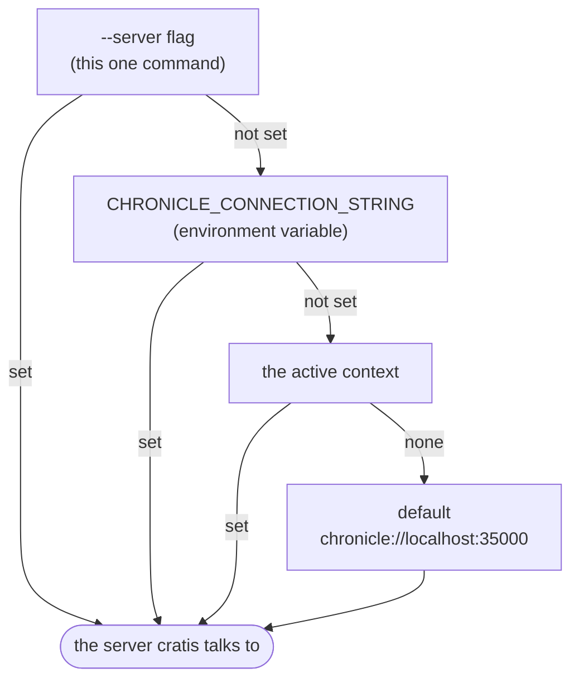

import { Steps, Tabs, TabItem, Aside } from '@astrojs/starlight/components';

You've got a Chronicle store running — maybe the local one from the [Chronicle get-started](/chronicle/get-started/), maybe a staging server a colleague set up. Things are happening inside it: events are landing, projections are folding them into read models, reactors are firing. Right now the only way to *see* any of that is to write code. Let's fix that.

`cratis` is a terminal window into a running store. In the next couple of minutes you'll install it, point it at your Chronicle, and run one command that proves the connection and shows you around. After that, looking at events, observers, or read models is a single command each — never a query.

## Prerequisites

- **Nothing extra to install the CLI itself** — the steps below give you the `cratis` binary.
- **A running Chronicle store to connect to** — `cratis get-started` connects to a Chronicle server, so have one running first. The [Chronicle get-started](/chronicle/get-started/) brings a local one up with `docker compose up` in about a minute; against that local store there's nothing to configure — the CLI finds it on its own.

## Install it

Pick the install that matches your machine. However you do it, you end up with the same `cratis` binary on your `PATH`.

<Steps>

1. **Install the CLI.**

   <Tabs>
   <TabItem label="macOS (Homebrew)" icon="apple">
   ```bash title="Install with Homebrew"
   brew tap cratis/cratis
   brew install cratis
   ```

   Upgrade later with a single `cratis update`.
   </TabItem>
   <TabItem label="Linux" icon="linux">
   Download the pre-built native binary from the [latest release](https://github.com/Cratis/cli/releases/latest) and put it on your `PATH`:

   ```bash title="Install the native binary"
   # x64 (Intel/AMD)
   curl -Lo cratis.tar.gz https://github.com/Cratis/cli/releases/latest/download/cratis-linux-x64.tar.gz
   # arm64: swap x64 for arm64 in the URL above
   tar -xzf cratis.tar.gz
   sudo mv cratis /usr/local/bin/cratis
   ```

   To upgrade, repeat with the newer release — `cratis update` prints these exact steps whenever a newer version is out.
   </TabItem>
   <TabItem label=".NET tool" icon="seti:c-sharp">
   If you already have the [.NET SDK](https://dotnet.microsoft.com/download) (10 or newer), install it as a global tool — handy in CI and on Windows:

   ```bash title="Install as a .NET global tool"
   dotnet tool install -g Cratis.Cli
   ```

   Upgrade later with a single `cratis update`.
   </TabItem>
   </Tabs>

2. **Prove it's there.** Run `cratis` with no arguments. It prints the connection it's pointing at — the active context's name and the server URL it will talk to:

   ```bash title="Check the active connection"
   cratis
   ```

   The first time you run *any* `cratis` command, it quietly creates a `default` context aimed at `chronicle://localhost:35000` — so on a local box this already points somewhere sensible. We'll come back to what a context is.

3. **Connect and look around.** `cratis get-started` does two things: it checks it can actually reach the server, then prints a guided summary of the commands you'll reach for most, grouped by what you're trying to do.

   ```bash title="Test the connection and get a tour"
   cratis get-started
   ```

   If it reports a successful connection, you're done — the CLI is installed and talking to your store.

</Steps>

## Keep it up to date

The CLI moves quickly, and "how did I install this again?" is a question you shouldn't have to answer every time a release lands. You don't — the CLI updates itself:

```bash title="Update to the latest version"
cratis update
```

`cratis update` detects how this particular `cratis` got onto your machine and runs the right mechanism for it: on a Homebrew install it runs `brew update` followed by `brew upgrade cratis`; on a .NET tool install it runs `dotnet tool update -g Cratis.Cli`. Either way it ends by telling you exactly what happened:

```text title="What you'll see"
Updating Cratis CLI... (current: 1.2.0)
Updated from 1.2.0 to 1.3.0
```

If you're already current, it says so — `Already at the latest version (1.3.0)` — so the command is always safe to run.

Need a specific version rather than the latest? Pass `--version`:

```bash title="Install a specific version"
cratis update --version 1.2.3
```

<Aside type="note">
`--version` works on .NET tool installs only — Homebrew can only move to the latest formula, and the CLI tells you so rather than guess. The Linux native binary can't replace itself either; there, `cratis update` prints the same download-and-replace steps from the install tab above so you don't have to go looking for them.
</Aside>

## How `cratis` decides where to connect

`cratis get-started` connected with zero configuration, which is worth understanding rather than taking on faith. Every command needs one thing: a server to talk to. `cratis` resolves it by walking a short list of sources, top to bottom, and using the first one that's set:



On your machine nothing above the default is set, so it lands on `chronicle://localhost:35000` — your local store. That's why "install and go" just works. The two layers above the context — the environment variable and the `--server` flag — are escape hatches for automation and one-off commands; you'll meet them when you need them.

## Point it at another store

A **context** is a named connection. You already have `default`; real work usually means a couple more — staging, production — so you can switch between them without retyping URLs.

Repoint the default at a different server:

```bash title="Change where 'default' points"
cratis context set-value server chronicle://myserver.example.com:35000/
```

Or keep `default` for local and add a named context per environment, then switch the active one:

```bash title="Add and switch to a staging context"
cratis context create staging --server chronicle://staging.example.com:35000/
cratis context set staging
```

From here on, every command talks to staging until you switch back. For CI and containers, skip contexts entirely and set `CHRONICLE_CONNECTION_STRING` in the environment — it wins over the active context but yields to an explicit `--server`. Full details are on the [Context](../context/index.md) page.

## Two niceties worth a minute

**Tab completion.** Let your shell finish commands and options for you:

```bash title="Install shell completions"
cratis completions install
```

It detects your shell automatically (override with `--shell bash|zsh|fish|powershell`); on Windows it writes the hook to your PowerShell `$PROFILE`. Restart your shell to pick it up.

**Teach your AI assistant about your store.** Run `cratis init` inside a project and the CLI writes a `CHRONICLE.md` describing every command it can run, installs instruction files for Claude Code, GitHub Copilot, Cursor, and Windsurf, and adds a `chronicle-diagnose` slash command — so your assistant can help operate the store too:

```bash title="Set up AI tooling"
cratis init
```

Refresh the embedded snapshot after a CLI upgrade with `cratis init --refresh`. For the same catalog as raw JSON, run `cratis llm-context` (add `--schema` for its JSON Schema).

## Recap

In a couple of minutes you installed `cratis`, watched it find your local Chronicle through the `default` context, and confirmed the connection with `cratis get-started`. Staying current is one command — `cratis update` — no matter how the CLI was installed. You also saw the one rule that governs every command — flag, then environment variable, then context, then the local default — so nothing about *where* it connects is a mystery anymore.

## Where to go next

- **Actually look at something** — the [Chronicle commands](/cli/chronicle/) browse events, observers, and read models in a live store.
- **Solve a real problem** — the [Scenarios](/cli/scenarios/) walk through fixing a stuck observer, replaying a projection, and verifying events were appended.
- **Manage connections properly** — the [Context](../context/index.md) page covers creating, switching, and inspecting contexts in depth.
